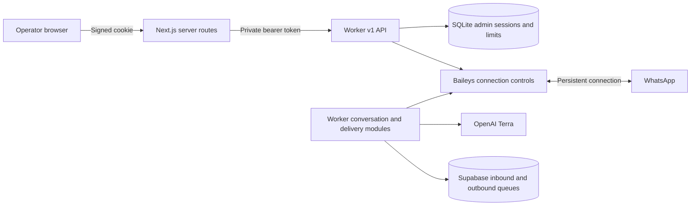

# Admin boundary

Reviewed **1 October 2026**, alongside worker release `5eb14d0`.

The browser communicates only with this Next.js application. Server routes verify the admin cookie and its persisted hash, then call an allowlisted worker endpoint with the private API token. The worker owns WhatsApp and durable state; it is not imported into this application.

The worker's conversation path is LangGraph `converser → formatter`, followed by durable outbound delivery. Exact queue names are `ramesh-inbound-queue` and `ramesh-outbound-queue`. The encrypted inbox in `ramesh-messages` supplies both this admin and recent model context. This admin has no direct database or model connection. Manual text goes directly to the outbound queue with the same delivery protections. Deploy worker migration `202610010003` and the inbox endpoints before this admin update.

`src/lib/worker-api.ts` describes the expected v1 wire format. `src/server/worker-client.ts` validates it and limits response size/time. Login and mutating routes reject foreign origins and oversized JSON. Rendering components receive status, never server secrets. QR values stay in memory and are removed when the worker is unavailable or a control operation invalidates them.

## API and authentication

| Browser route           | Worker operation                                                                                                      |
| ----------------------- | --------------------------------------------------------------------------------------------------------------------- |
| `POST /api/session`     | Login limit check and creation of an eight-hour session hash                                                          |
| `DELETE /api/session`   | Session revocation before cookie removal                                                                              |
| `GET /api/bot/status`   | Authenticated `GET /v1/status`                                                                                        |
| `POST /api/bot/control` | Authenticated `POST /v1/control` with connect/disconnect/reconnect                                                    |
| `GET /api/bot/inbox`    | Authenticated `GET /v1/inbox/conversations`; with `chatId`, `GET /v1/inbox/messages`. Both accept an opaque `cursor`. |
| `POST /api/bot/inbox`   | Same-origin authenticated `POST /v1/inbox/send` with existing chat ID, 1–4,000 characters, and idempotency UUID.      |

The browser never receives `WORKER_API_TOKEN`. Cookies are HttpOnly, SameSite=Strict, and Secure on HTTPS; mutations check the configured origin. Session verification depends on worker availability and fails closed. The admin accepts bounded JSON responses, refuses redirects, and applies request deadlines. Status polling is serialized and stale responses cannot overwrite newer control state.

The admin needs only its operator password, cookie secret, origin, worker URL, and matching worker token. It does not need `OPENAI_API_KEY`, an employee MCP OAuth token, or Supabase credentials. Operator authentication controls the linked account; it does not establish employee identity or authorize CRM reads.

## Network and test boundaries

The current EC2 security group has no inbound rules and its API binds to `127.0.0.1:3011`. A local admin can reach it through an authorized SSM tunnel, documented on local port **3013**. Vercel needs a separate reachable HTTPS/private gateway arrangement; the worker's Caddy template is a future rollout option, not evidence that the API is publicly reachable.

The worker's fake chat GUI at **3012** is a different application. It uses isolated SQLite, fake chat identities, real model calls, and captured replies; it never opens WhatsApp or Supabase. This admin at **3010** controls whichever worker `WORKER_API_URL` identifies, so a production URL makes pairing and connection controls live operations.

The HTTP worker fixture lets this repository run CI independently. Setting `BOT_WORKER_DIR` switches only the test supervisor to a real, separately installed worker's simulated transport entry point. It uses temporary SQLite, disables model and production Supabase calls, and never pairs or messages a real account. Application code never reads that setting. The worker's PostgreSQL, MCP, and live-model evaluation suites are maintained separately.

A shared operator password protects this first admin surface. Replace it with organizational SSO when individual admin attribution is needed. Salesperson identity, CRM scopes and group information policy remain worker/product design work rather than admin permissions.

## Planned extensions

Employee links and OAuth credential health, active runs, pending action confirmations, queue age, failed/uncertain sends, and alert history belong to later admin work. The worker's planner, tool executor, and verifier agents are deferred. Reminder escalation is planned for assignee(s), then existing CRM admins; no reminder editor or scheduler exists in this console.

See the [worker architecture plan](https://github.com/rs0125/ramesh-bot/blob/main/docs/assistant-architecture-plan.md) for the full system diagram and MCP contract, [queue guide](https://github.com/rs0125/ramesh-bot/blob/main/docs/supabase-message-queue.md) for delivery semantics, and [EC2 operations](https://github.com/rs0125/ramesh-bot/blob/main/docs/ec2-operations.md) for current access and recovery.
